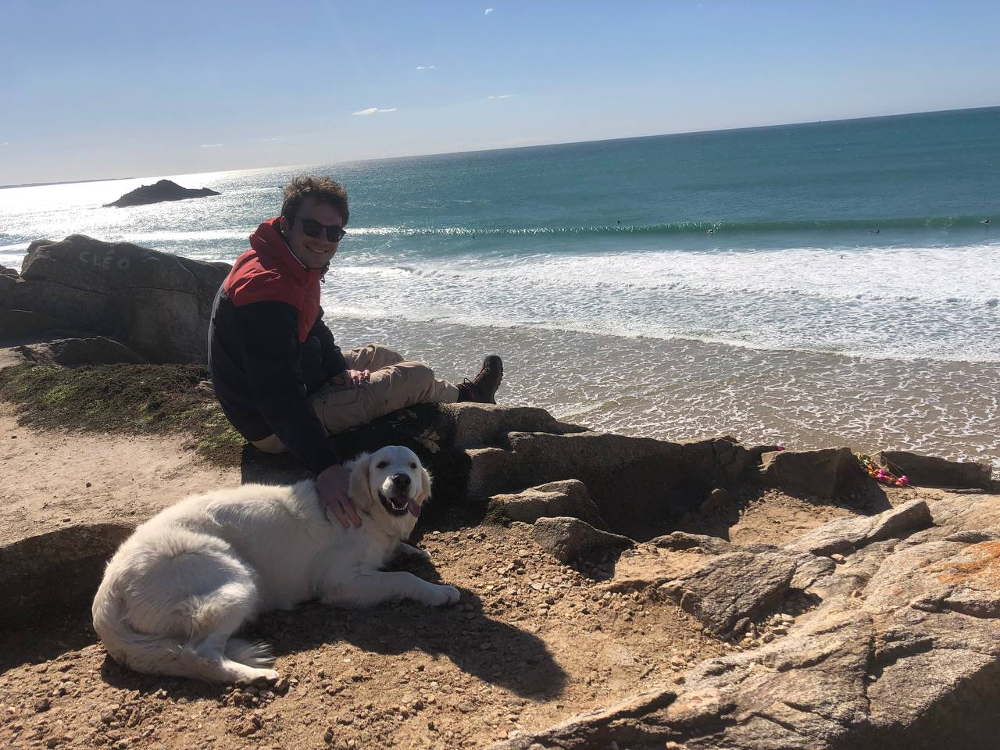

*Photo de moi à la plage avec un chien (mais c'est pas mon chien).*

Je conçois depuis 3 ans des solutions pour l’exploitation de données. 
Je vis à Brest où je me suis bien installé.

## Accès

- En ligne : <http://leolelonquer.github.io/blog>
- local : <http://127.0.0.1:4000/>
- repo : <https://github.com/LeoLeLonquer/blog>

## Jekyll local test

Installer Jekyll : [Jekyll Quickstart](https://jekyllrb.com/docs/)

Cloner le projet
```bash
git clone https://github.com/LeoLeLonquer/blog
````

Pour lancer un serveur local, se placer dans le dossier et lancer :  
```bash
jekyll serve --livereload
```
Si bug au démarrage exécuter : `bundle add webrick`.

## License

[public domain](http://unlicense.org/)
