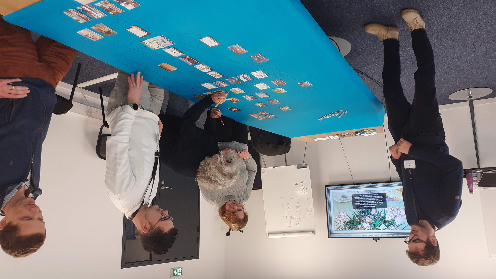
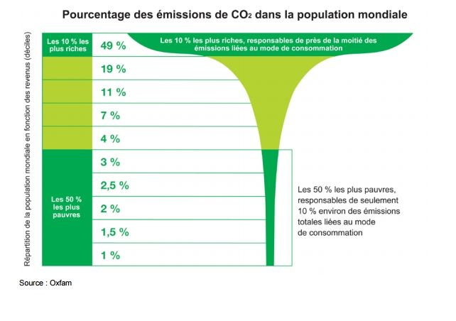

Je suis en transition entre deux missions, j'ai donc pu participé à une [fresque du climat](https://fresqueduclimat.org/) organisée par ma boîte CapGemini et Thomas Le Boulicaut ce vendredi 25 novembre. L'occasion de faire le point sur ma connaissance du réchauffement climatique.

<!--more-->

## Le constat 

L'idée de la fresque est de relier pas-à-pas des phénomènes entre causes et des conséquences, de les enchaîner pour obtenir au final un aperçu général des dynamiques à l'œuvre. 

Voici quelques bons exemples mis en évidence pour rafraîchir la mémoire :

- certains domaines d'activité comme l'agriculture et l'élevage qui jouent un rôle particulier depuis leur industrialisation, notamment la production de protoxyde d'azote lors de l'épandage de lisier ou d'engrais azotés (eux-même produits grâce à des énergies fossiles) ainsi que le rot méthanisé des vaches (et non les pets !)
- les phénomènes océaniques du réchauffement sont quasiment inconnus du grand public. Par exemple l'acidification des océans entrave la calcification du plancton et fatalement impacte toute la chaîne alimentaire. 
- Les gazs à effet de serre qui participent au réchauffement climatique sont une partie minime des émissions totales (7% je crois). La majorité est absorbée par les océans, les forêts. Une partie reste dans l'atmosphère et conduit à l'effet de serre.

## Les actions

Après s'être préparé à une apocalypse climatique et guerrière, la deuxième partie de l'après-midi est  consacrée aux méthodes pour lutter contre le réchauffement. L'accord de Paris stipule que ses signataires s'engagent à réduire à 2T de CO2 par personne et par an en 2050. Nous en sommes à 10T dans les pays du Nord actuellement. 

Nous découvrons les effets d'échelle, ce qui incombe à l'individu et au collectif et la répartition des émissions au niveau mondial. 
La démonstration des faits est très honnête, on comprend vite qu'il ne s'agit pas seulement de trier nos déchets et que l'action individuelle ne nous sauvera pas. Ce sont nos modes de production qui sont à revoir de fond en comble.

J'aime beaucoup ce graphique :  

On y observe la distribution des émissions de CO2 au niveau mondial, mais on pourrait également le lire comme la répartition de la consommation de ressources au niveau mondial. De ce point de vue, il illustre le rapport de production-consommation entre les pays du Nord et du Sud.

Globalement le chantier est phénoménal !

## Conclusion

Pas de doute là-dessus, la démonstration de la fresque est la suivante : les activités industrielles telles qu'elles sont pratiquées aujourd'hui impactent fortement les cycles naturels existants et entraînent un effet boule de neige qui conduit à un réchauffement général de la température sur Terre. 
Pour l'instant, nous ne sommes clairement pas à la hauteur de l'enjeu, la vie de millions de personnes sur Terre est compromise. Il faut changer de modèle économique !

Merci à Thomas Le Boulicot et CapGemini pour cette après-midi enrichissante.

#### A noter

Il existe d'autres fresques sur des thèmes précis issus de cette première fresque générale :

- fresque de la biodiversité
- fresque de l'océan (en préparation par l'Ifremer)
- fresque de l'économie
