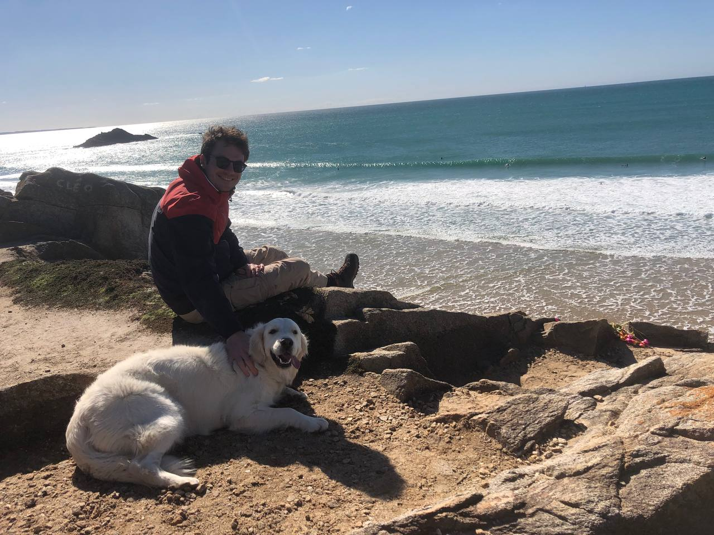

*Photo de moi à la plage avec un chien (mais c'est pas mon chien).*

Ambitieux et incompétent, je conçois des solutions pour l’exploitation de données. 
Je vis à Brest où je me suis bien installé.

## CV

Si vraiment vous souhaitez en savoir plus, allez donc jeter un coup d'œil à mon CV (en espérant qu'il est à jour) par ici :  
[⇒⇒⇒⇒CV⇐⇐⇐⇐](../pages/cv.html)

## Design graphique

Le design utilisé pour mon site ne fait pas consensus, c'est pourtant du [Skeuomorphisme](https://fr.wikipedia.org/wiki/Skeuomorphisme). Merci à tous les rageux de se cultiver.  
Grandement inspiré du thème [Leap Day](https://github.com/pages-themes/leap-day)

## License

[public domain](http://unlicense.org/)
